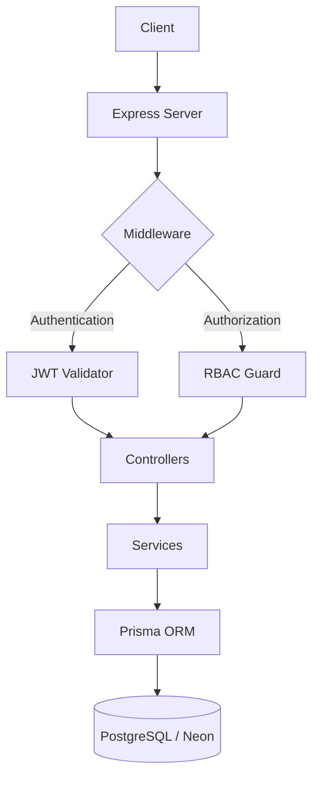

# 💰 Finance Data Processing and Access Control Backend

[](https://nodejs.org/)
[](https://www.typescriptlang.org/)
[](https://www.prisma.io/)
[](https://www.postgresql.org/)
[](https://render.com/)

A production-grade financial data management system built with a **Security-First** mindset. This backend implements a robust **Role-Based Access Control (RBAC)** architecture, ensuring that financial data is processed and accessed only by authorized personnel.

---

## 🚀 Live Deployment

The API is fully deployed and can be accessed at the following endpoints:

- **🏠 API Root:** [https://finops-rbac-backend.onrender.com/](https://finops-rbac-backend.onrender.com)
- **📚 Interactive API Docs:** [https://finops-rbac-backend.onrender.com/api-docs](https://finops-rbac-backend.onrender.com/api-docs)

---

## 🏗️ System Architecture

This project follows a **Layered Architecture** (Controller-Service-Repository pattern) to ensure separation of concerns and maintainability.



### 📂 Folder Structure
- `src/config/`: Configuration for Swagger, database, and environmental settings.
- `src/controllers/`: Request handling and response mapping.
- `src/services/`: Core business logic and database interactions.
- `src/routes/`: Route definitions and endpoint mapping.
- `src/middlewares/`: Authentication, RBAC, and error-handling middleware.
- `src/validators/`: Request validation using Zod/Joi.
- `src/types/`: TypeScript interfaces and custom definitions.

---

## 🔑 Test Credentials

Use these accounts to test the different access levels (RBAC) in the system:

| Role | Email | Password |
| :--- | :--- | :--- |
| **Admin** | `admin@example.com` | `Password123!` |
| **Analyst** | `analyst@example.com` | `Password123!` |
| **Viewer** | `viewer@example.com` | `Password123!` |

---

## 🛡️ Security Features

Security is baked into the core of this application:
- **JWT Authentication:** Secure stateless session management.
- **RBAC (Role-Based Access Control):** Granular permissions for Admin, Analyst, and Viewer roles.
- **Helmet:** Protects against well-known web vulnerabilities by setting various HTTP headers.
- **Rate Limiting:** Prevents brute-force attacks and abuse.
- **CORS:** Controlled access for specific domains.
- **Zod Validation:** Strict input sanitization for all request bodies and queries.
- **Bcrypt:** Industry-standard password hashing with high salt rounds.

---

## 🗄️ Database Schema (Prisma)

The system manages two primary entities via the Prisma ORM:
- **User:** Handles authentication, credentials, and role assignments (`ADMIN`, `ANALYST`, `VIEWER`).
- **Record:** Stores financial data including amount, category (`INCOME`, `EXPENSE`), date, and creator association.

---

## 📚 API Documentation (Swagger)

The project includes interactive API documentation powered by Swagger (OpenAPI 3.0).
- **Endpoint:** `/api-docs`
- **JSON Spec:** `/api-docs.json`

### Highlights:
- **Authentication:** Integrated "Authorize" button for JWT Bearer tokens.
- **Schemas:** Comprehensive models for all requests and responses.
- **Tags:** Categorized by Authentication, Financial Records, and Dashboard.

---

## ⚙️ Local Development Setup

```bash
# 1. Install dependencies
npm install

# 2. Sync database schema
npx prisma generate
npx prisma migrate dev --name init

# 3. Seed test data
npx prisma db seed

# 4. Start development server
npm run dev
```

---

## 🧪 Testing

This project includes a comprehensive suite of **Pure logic Unit Tests**.

### Running Tests:
```bash
# Run all tests
npm test

# Run with coverage report
npm run test:coverage

# Watch mode (for development)
npm run test:watch
```

### Coverage Areas:
- **Validation:** Password rules, email formats, and amount constraints.
- **RBAC Permission Logic:** Hierarchical verification for all roles.
- **Financial Calculations:** Summary statistics and net balance logic.
- **Utilities:** Date filtering and category-based sorting.

---

## 👨‍💻 Author

**Deepyaman Mondal**  
*Backend / Software Engineer*

- **GitHub:** [@DevRony04](https://github.com/DevRony04)
- **Status:** Production Ready

---
*License: This project is licensed under the MIT License.*
