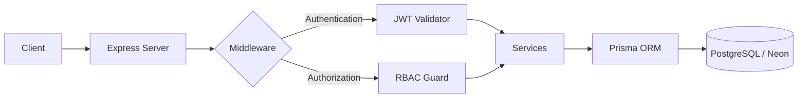

# 💰 Finance Data Processing & RBAC Backend

[](https://nodejs.org/)
[](https://www.typescriptlang.org/)
[](https://www.prisma.io/)
[](https://www.postgresql.org/)
[](https://render.com/)

A production-grade financial data management system built with a **Security-First** mindset. This backend implements a robust **Role-Based Access Control (RBAC)** architecture, ensuring that financial data is processed and accessed only by authorized personnel.

---

## 🚀 Live Deployment

The API is fully deployed and can be accessed at the following endpoints:

- **🏠 API Root:** [https://finops-rbac-backend.onrender.com/](https://finops-rbac-backend.onrender.com)
- **📚 Interactive API Docs:** [https://finops-rbac-backend.onrender.com/api-docs](https://finops-rbac-backend.onrender.com/api-docs)

---

## 🏗️ System Architecture



---

## 🔑 Test Credentials

Use these accounts to test the different access levels (RBAC) in the system:

| Role | Email | Password |
| :--- | :--- | :--- |
| **Admin** | `admin@example.com` | `Password123!` |
| **Analyst** | `analyst@example.com` | `Password123!` |
| **Viewer** | `viewer@example.com` | `Password123!` |

---

## 🔄 How to Use (API Flow)

1. **Login**: Send a `POST` request to `/api/auth/login` with your credentials.
2. **Get Token**: Copy the `token` from the JSON response.
3. **Authorize**: 
   - Open **Swagger UI** (`/api-docs`).
   - Click the **"Authorize"** button.
   - Enter your token as: `Bearer <your_token_here>`.
4. **Access**: You can now test protected routes based on your character's role!

---

## 📌 Key Endpoints

### Authentication
- `POST /api/auth/login` - Get access token
- `POST /api/auth/register` - Create new account (Default: VIEWER)

### Financial Records
- `GET /api/records` - List records (Role-filtered)
- `POST /api/records` - Create new record (**Admin Only**)
- `PATCH /api/records/:id` - Update record (**Admin Only**)

### Dashboard & Analytics
- `GET /api/dashboard/summary` - High-level totals (All Roles)
- `GET /api/dashboard/trends` - Monthly growth charts (**Analyst/Admin**)
- `GET /api/dashboard/categories` - Spending breakdown (**Analyst/Admin**)

---

## ⚙️ Local Development Setup

```bash
# 1. Install dependencies
npm install

# 2. Sync database schema
npx prisma generate
npx prisma migrate dev --name init

# 3. Seed test data
npx prisma db seed

# 4. Start development server
npm run dev
```

---

## 🧪 Testing

This project includes a comprehensive suite of **Pure logic Unit Tests**.

### Key Features:
- **Database-Independent:** No database connection or Prisma setup required.
- **Fast Execution:** 20+ tests run in under 3 seconds.
- **Production Safe:** Tests use `devDependencies` only and are excluded from the production build.

### Running Tests:
```bash
# 1. Run all tests
npm test

# 2. Run with coverage report
npm run test:coverage

# 3. Watch mode (for development)
npm run test:watch
```

### What's Tested:
- **Validation:** Password strength, email formats, and amount rules.
- **RBAC:** Hierarchical permission logic for ADMIN, ANALYST, and VIEWER.
- **Calculations:** Financial summaries, totals, and net balance logic.
- **Utils:** Date range filtering, category sorting, and data sanitization.

---

## 👨‍💻 Author

**Deepyaman Mondal**  
*Backend / Software Engineer*

- **GitHub:** [@DevRony04](https://github.com/DevRony04)
- **Status:** Production Ready

---
*License: This project is licensed under the MIT License.*
